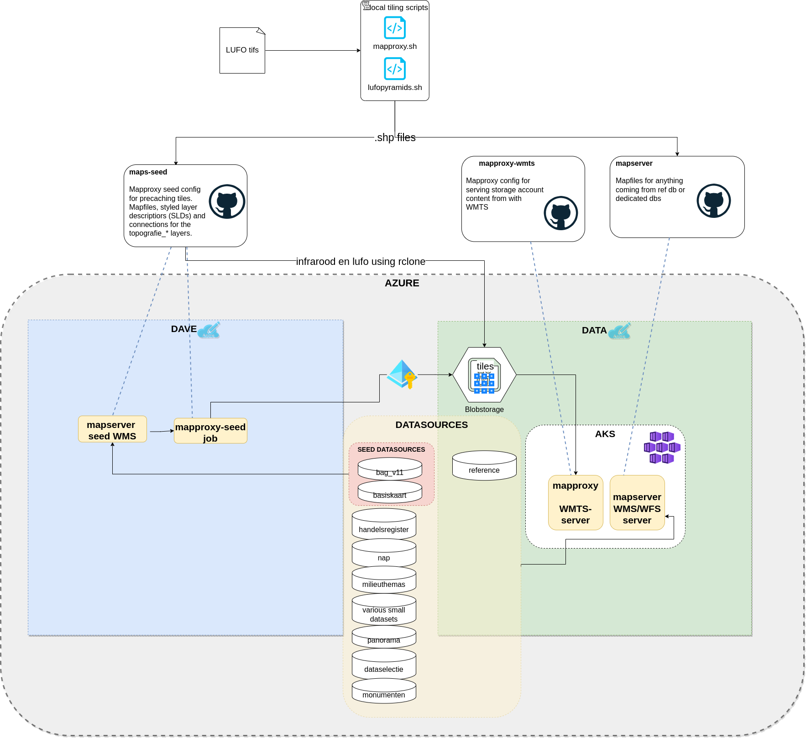

# maps-seed

The MapProxy and Mapserver logic for seeding basis-topografieen tiles.

In order to serve pregenerated tiles, we need to seed a variety of datasources.
Seeding, in this context, means converting geo-data to a [TMS](https://en.wikipedia.org/wiki/Tile_Map_Service) file and directory structure so that it can be used as an input to map clients (e.g.  Leaflet, Mapbox GL) and served from WMTS servers (such as MapProxy).

We seed the following maps:

- 1 basis topografieen
    tiled using a MapProxy seed configuration that consumes from the Mapserver WMS and writes to a volume mount. The contents of this volume mount is then written to an objectstore.
- 2 luchtfotos tiled manually by adding TIF files and running shell scripts, then uploaded using rclone
- 3 infrarood follows the same procedure as 2

# Architecture context

